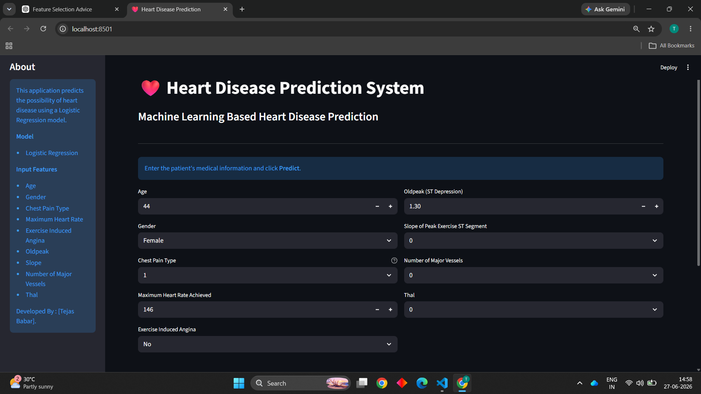
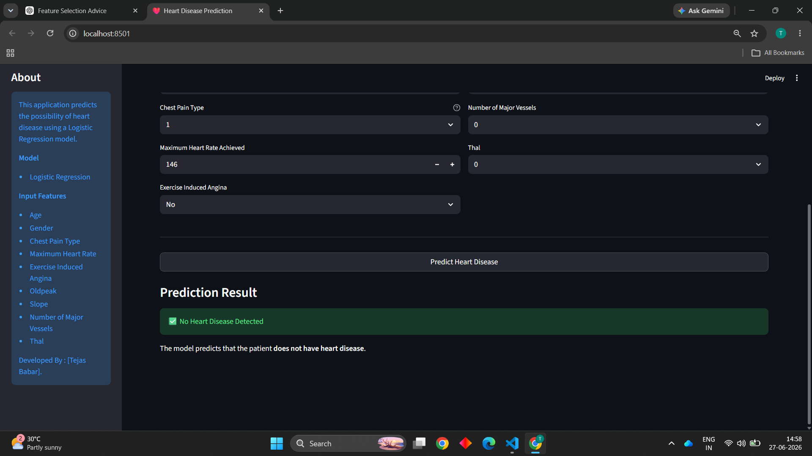

# ❤️ Heart Disease Prediction using Machine Learning

A Machine Learning-based web application that predicts the likelihood of heart disease using **Logistic Regression**. The project includes data preprocessing, feature selection, model training, model evaluation, and deployment using **Streamlit**.

## 🌐 Live Demo

🔗 **Streamlit App:**  
https://heart-disease-prediction-tejasbabar06.streamlit.app/

---

## 📌 Project Overview

Heart disease is one of the leading causes of death worldwide. This project uses a Logistic Regression model trained on the Cleveland Heart Disease dataset to predict whether a patient is likely to have heart disease based on clinical parameters.

The application provides an easy-to-use web interface where users can enter patient information and receive an instant prediction.

---

## 🚀 Features

- ❤️ Heart Disease Prediction
- 🤖 Logistic Regression Machine Learning Model
- 📊 Data Preprocessing & Feature Selection
- 📈 Model Performance Evaluation
- 🌐 Interactive Streamlit Web Application
- ⚡ Real-time Prediction
- 📱 Responsive and User-Friendly Interface

---

## 🛠️ Tech Stack

- Python
- Pandas
- NumPy
- Scikit-learn
- Streamlit
- Pickle

---

## 📂 Project Structure

```
Heart-Disease-Prediction-ML/
│
├── dataset/
│   └── Heart_disease_cleveland_new.csv
│
├── notebook/
│   └── Heart_disease.ipynb
│
├── screenshots/
│   ├── homepage.png
│   └── predict.png
│
├── app.py
├── heart_disease_model.pkl
├── requirements.txt
├── .gitignore
└── README.md
```

---

## 📊 Dataset

**Dataset Name:** Cleveland Heart Disease Dataset

The dataset contains patient medical records with several clinical features used for predicting heart disease.

### Features Used

- Age
- Sex
- Chest Pain Type
- Maximum Heart Rate Achieved
- Exercise-Induced Angina
- Oldpeak
- Slope
- Number of Major Vessels
- Thal

---

## 🤖 Machine Learning Model

**Algorithm Used**

- Logistic Regression

---

## 📈 Model Performance

| Metric | Score |
|---------|-------|
| Accuracy | **90%** |
| Precision | **93%** |
| Recall | **88%** |
| F1 Score | **90%** |

---

## 📸 Application Screenshots

### 🏠 Home Page



### ❤️ Prediction Result



---

## ⚙️ Installation

### Clone Repository

```bash
git clone https://github.com/tejasbabar06/Heart-Disease-Prediction-ML.git
```

### Move to Project Directory

```bash
cd Heart-Disease-Prediction-ML
```

### Install Dependencies

```bash
pip install -r requirements.txt
```

### Run the Application

```bash
streamlit run app.py
```

---

## 💻 Author

**Tejas Babar**

B.Tech Computer Science & Engineering (Artificial Intelligence & Machine Learning)

GitHub: https://github.com/tejasbabar06

LinkedIn: https://www.linkedin.com/in/tejasbabar-aiml/

---

## ⭐ Support

If you found this project helpful, please consider giving it a ⭐ on GitHub.
